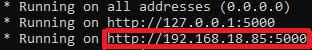

I always wanted transfer some files along my local network, PC to smartphone and smartphone to PC. So, I've decided to make my own local transfer.
Of course, I still have more work to do on it, but I'm really happy because I did it just by using the documentation.

Now, how can I use it?

You have to execute the file "app.py", then you probably see something like it:

(that's my IPv4)

Following the image, you'll see that your local server ip is your IPv4 at port 5000. Now, just type the IP and port (exactly what are to you) on your browser.
Now you can access the local server by any device (PC, Laptop, Smartphone...), since it are connect at your internet.

You can just upload your files right now clicking by "choose files" (or something like) and then upload. Look below:

But, how can I download?

Just click at name or image for the file that you want.

At this moment, images and gifs are visible. Other files like .txt and .rar don't have their icons yet, but this is something that I'll work.
